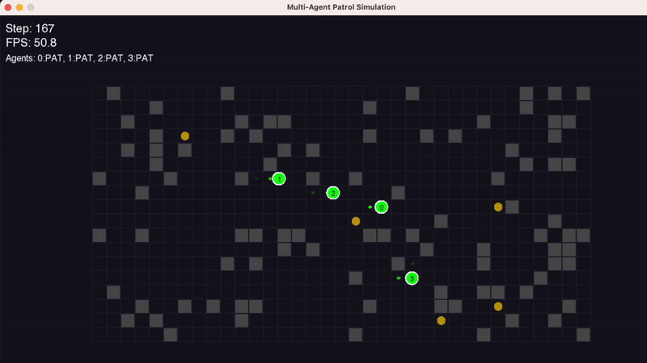

# Multi-Agent Patrol Sim

A C++ project I built to explore autonomous agents with behavior trees and pathfinding related to my interest in EVs, robotics, and AI.



*Note: The GIF compression makes the visualization appear choppy - the actual simulation runs much smoother when viewed live or in video format.*

## What it does

- Multiple agents patrol around independently (currently 4 of them)
- Each agent has its own "brain" using behavior trees 
- A* pathfinding (shortest path search algo) so they don't walk into walls
- The agents wander and try to avoid bumping into each other
- Tweakable settings if you want to mess around with parameters (grid size, number of agents, speed, etc)

## Project structure

```
multi-agent-patrol-sim/
├── src/
│   ├── main.cpp               # main simulation loop
│   ├── config.hpp             # all the tunable parameters
│   ├── grid.hpp/cpp           # grid world management 
│   ├── agent.hpp/cpp          # agent logic + behavior trees
│   ├── behavior_tree.hpp/cpp  # the actual behavior tree stuff
│   ├── pathfinding.hpp/cpp    # A* implementation
│   └── utils.hpp/cpp          # random helper functions
├── assets/                    # for adding graphics later (TODO) 
├── CMakeLists.txt            # build config
└── README.md                 # you are here
```

## Building and Running

```bash
# standard cmake dance
mkdir build && cd build
cmake ..
make

# run it
./MultiAgentPatrolSim
```

If you want debug info or optimizations:
```bash
cmake -DCMAKE_BUILD_TYPE=Debug ..     # for debugging
cmake -DCMAKE_BUILD_TYPE=Release ..   # for speed
cmake -DENABLE_ASAN=ON ..             # if things are crashing weirdly
```

## How to use it

Agents wander partrol points and avoid other agents and obstacles. They show up as A0, A1, A2 etc, obstacles are the █ blocks. 

Edit `src/config.hpp` - you can change grid size, number of agents, how fast they move, etc.

## The technical bits

### Behavior Trees
Ended up going with behavior trees due to flexibility.
- Composite nodes (sequence, selector) 
- Some decorators for retry logic
- Leaf nodes for actual actions
- Easy enough to add new behaviors without breaking everything

### Pathfinding  
A* seemed like the obvious “search” choice - works well for this grid setup. Does dynamic replanning when agents get in each other's way.

### Multi-agent stuff
No central coordinator - each agent moves on its own and reacts to the others. 

### Visualization & Display
Added support for both terminal and GUI modes. The SFML graphics mode gives you a proper window with smooth movement and better visual feedback.

### Recent Updates
Been tweaking the simulation based on what I've observed:
- Improved stuck detection - agents now recognize when they're not making progress and try alternative routes
- Better coordination between agents to reduce deadlocks
- Added configurable simulation speed so you can watch the action in slow motion or speed it up
- More detailed statistics tracking for analyzing agent behavior patterns
- Grid generation got smarter about creating interesting but navigable obstacle layouts

The configuration system is pretty flexible now - you can adjust everything from grid size and agent count to movement speed and vision range without recompiling.

## Lessons learned

### What went well:
- Behavior trees worked well, but were a bit difficult to implement to get started
- A* worked well without many complications  
- Visualization is a really cool feature (reminds me of roomba) 
- Modular design was helpful  when debugging (could test pathfinding separately)

### What was trickier than expected:
- Agent collision avoidance. First attempt was basically "stop and wait" which led to deadlocks
- Debugging multi-agent interactions
- C++ templates for the behavior trees

### If I did this again:
- Would start with fewer agents
- Add proper logging system instead of count spam
- Obstacle avoidance could be optimized - right now it's pretty naive
- Should have written tests earlier
- Grid visualization could show agent paths/intentions 

### Weird issues I ran into:
- Agents would sometimes get "stuck" not because of obstacles, but because of floating point precision
- Had a bug where agents would prefer moving diagonally even when straight lines were better
- Memory management with the behavior trees was messier than expected

The biggest thing was realizing that "simple" multi-agent systems get complex fast. Even with just a few agents, you start seeing emergent behaviors you didn't expect. Sometimes they form convoys, other times they create traffic jams at narrow passages.


## TODO

- Machine learning so agents get better over time
- Network support for distributed sims
- Better performance metrics
- 3D?
